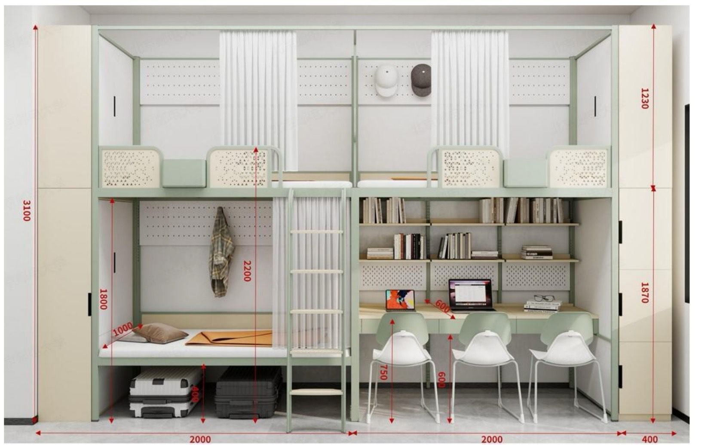

## 简介

根据宿舍楼的位置，沙河校区的宿舍分为雁北园和雁南园。相对而言，雁北园的条件会差一些，比如阳台空间较小、公共浴室较为破旧和储物空间较少。

**雁北园**位于鸿雁路北侧，各区域的代号为 A/B/C/D1/D2/E，离风味餐厅、教工餐厅、操场、生活服务区较近。其中，A/B/C/D1 是四栋矩形相连的宿舍楼（一楼入口独立，三楼及以上的部分相连）。其中 C 与 D1 入口有电梯，而 A 与 B 入口没有；D2/E 是另两栋在更北侧，独立于 A/B/C/D1 楼，且相对较小的宿舍楼，其内部也是相连的。D2 入口有电梯，而 E 入口没有。

**雁南园**位于鸿雁路南侧，各区域的代号为 S2/S3/S4/S5/S6（S1 是信息中心楼）[^1]，离教学楼、学生餐厅和景观湖较近。其中，S2/S3/S4/S5 是四栋平行的宿舍楼；S6 是一栋单独的宿舍楼。因为 S6 于 2020 年才投入使用，所以其住宿条件也是全校最好的。雁南每栋每个入口均有电梯。

按照学校安排，所有的女生应该会统一入住 S4、S5 和 S6，其中 S4 为男女混住，其余宿舍均为男生宿舍。

新生入学如果宿舍楼层较高，搬行李之前可首先考虑分析电梯与宿舍的连接情况，再决定如何搬运。

## 宿舍内环境

2025 级新生入学以前，沙河校区的宿舍配置均为四人间、上床下桌、独卫、层浴。2025 级新生入学时部分四人间将改为六人间，具体信息有待进一步确认。

- 若改为六人间，床位配置将是上四床、下两床两桌。两桌将由六个人分摊，空间非常局促。
- 卫生间只有蹲便器和洗脸面盆，不可洗澡；部分楼宇会将蹲便器和洗脸池分为两个区，其中蹲便器区域有门而洗脸池区没有门。
- 宿舍不提供床褥、垃圾桶、蚊帐、扫把等生活用品，如有需要请自行购置[^2]。空调遥控器在宿管处领取，搬离时还需交回。
- 房间有空调和暧气，供暧十分给力，冬季一般无需厚被。
- 有阳台。

|S6|非S6四人间|六人间|
|---|---|---|
|||待补充|

### 床位尺寸

原四人间床位尺寸可参考此图：

不同宿舍的柜子尺寸可能不同，仅供参考。上床离天花板的距离约为一米多，桌子可放置 27" 显示屏。

六人间的床位尺寸可参考此图：

## 宿舍外环境

每层楼平均有一个公共卫生间和澡堂。澡堂是简单淋浴房，需刷学生卡计费，大概每分钟 0.1 元。澡堂开放时间为 12:00 到 23:00。雁北 E 和雁南 S6 的澡堂有隔板，其它澡堂没有隔板。

一楼宿管前台有微波炉和吹风机，附近还有自动售货机，售卖简单的零食饮料。部分楼宇楼层有自习室，但设施简陋，只有几套桌椅，没有空调。

## 宿舍生活

### 舍友分配

宿友分配可能是随机分配的，也可能是按某种规则分配的，取决于辅导员。有些辅导员会收集学生的基本状况（如打呼噜）并据此分配。

但无论如何，当你遇到沟通不了的室友或解决不了的问题时，都可以找辅导员申请调解，或者调换寝室。

### 用电限制

原则上不允许使用微波炉、打火灶等大功率加热电器，也不允许使用冰箱、洗衣机。

每个宿舍都有总功率限制，用电总功率过高（比如六个游戏本一起跑满）可能引发跳阐。若有合理原因，可向宿管申请扩容。

### 床帘

原则上不允许装有色床帘，但辅导员和宿管一般不管。

### 查寝

宿管或辅导员可能偶尔查寝。

开学后的宿舍评比会看宿舍整洁度，优秀宿舍会加综评成绩（参见[学习生活/成绩构成](/学习生活/成绩构成/)），但实际影响微乎其微，不必太在意。

宿管可能会检查违禁电器，但检查频率不高，检查过程也不严格。

### 门禁与宵禁

沙河校区没有宵禁（比如校门 24 小时开放），但宿舍楼存在宵禁。

宿舍楼开放时间是 6:00 到 23:00，其它时段早出晚归都要提前联系辅导员报备，在门口拨打值班电话联系宿管，并在前台填表记录。

现阶段尚未启用门禁。但如需携带外人进入宿舍楼，需在宿管处登记。

### 水电费

卫生间用水不收水费。公共饮水机水费标准不一致，取决于具体设备。洗澡用水 0.1 元/分钟。

电费每人每学期赠送 40 度（总量取决于宿舍人数），用完需自行充值。电费价格为 0.48 元/度。充值入口位于「企业微信-宿舍用电」一栏。

### 限电限网

24 小时不断电不断网。

### 加长床

如果身高过高（需在 190 cm 以上），可在开学前向辅导员说明情况并申请更换加长床位。

但代价是可能不会和同班（甚至同专业）同学分在一个宿舍。

[^1]: 学校有三栋教学楼的代号也是 S1（教学楼）、S2（人文/马克思主义学院楼）和 S3（实验楼），不要和宿舍楼弄混。
[^2]: 新生入学期间，校内商家会供应床褥（价格适中，质量尚可）及常用生活用品。
