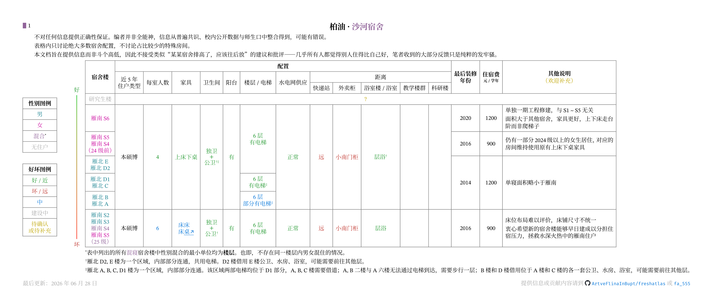
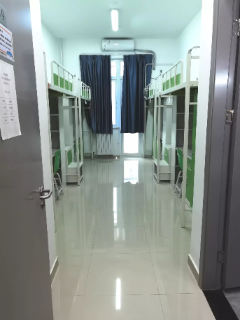
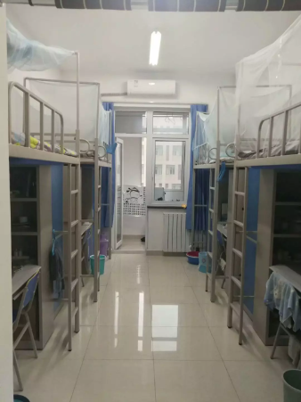
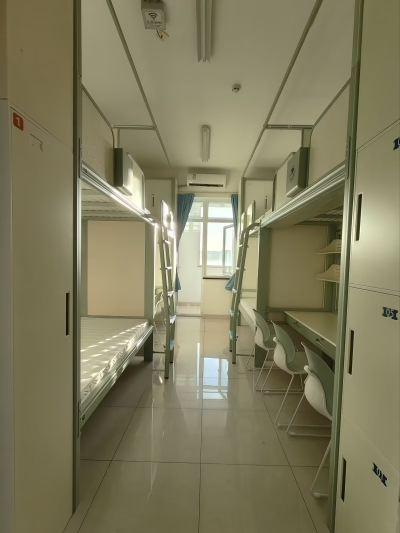
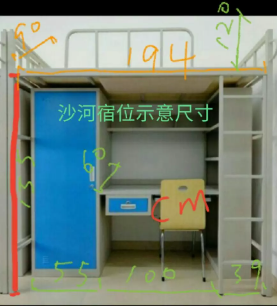

本节介绍沙河校区宿舍环境、生活设施和住宿相关注意事项。

## 简介

根据宿舍楼的位置，沙河校区的宿舍分为雁北园和雁南园。相对而言，雁北园的条件会差一些，比如阳台空间较小、公共浴室较为破旧和储物空间较少。

**雁北园**位于鸿雁路北侧，各区域的代号为 A/B/C/D1/D2/E，离风味餐厅、教工餐厅、操场、生活服务区较近。其中，A/B/C/D1 是四栋矩形相连的宿舍楼（一楼入口独立，三楼及以上的部分相连）。其中 C 与 D1 入口有电梯，而 A 与 B 入口没有；D2/E 是另两栋在更北侧，独立于 A/B/C/D1 楼，且相对较小的宿舍楼，其内部也是相连的。D2 入口有电梯，而 E 入口没有。

**雁南园**位于鸿雁路南侧，各区域的代号为 S2/S3/S4/S5/S6（S1 是信息中心楼），离教学楼、学生餐厅和景观湖较近。其中，S2/S3/S4/S5 是四栋平行的宿舍楼；S6 是一栋单独的宿舍楼。因为 S6 于 2020 年才投入使用，所以其住宿条件也是全校最好的。雁南每栋每个入口均有电梯。

按照学校安排，所有的女生应该会统一入住 S4、S5 和 S6，其中 S4 为男女混住，其余宿舍均为男生宿舍。

新生入学如果宿舍楼层较高，搬行李之前可首先考虑分析电梯与宿舍的连接情况，再决定如何搬运。

各楼栋在性别、配置、距离、装修年份、住宿费等方面的逐楼横向对比，可参考下图：

> 图片来源：[BUPT-freshatlas](https://github.com/ArtveFlinaInBupt/freshatlas)，原图含沙河、本部两校区，此处已拆分为仅沙河部分。以 CC BY-NC-SA 4.0 提供。

<!-- @byrdocs-bot 上图（沙河宿舍逐楼对比）文字版，供无法读图的助手参考；信息以图片为准。表格纵向按“好→差”排序。颜色含义已转为文字：好/近=优，坏/远=差，中=中等；性别用“男/女/混”标注。脚注用 * † ‡ 标记。距离含快递站 / 外卖柜 / 浴室 / 教学楼群 / 科研楼。

逐楼（从好到差）：
1. 研究生楼（建设中）：配置待确认；说明：大概率下学期将投入使用，猜测内部环境与学 13 类似，也有 2 人间与 4 人间。
2. 雁南 S6（女）：本硕博；4 人间(好)；上床下桌(好)；独卫+公卫(好)†‡；有阳台(好)；6 层有电梯(好)；水电网正常(好)；快递站远(差)；外卖小南门柜(差)；层浴(好)†；最后装修 2020；住宿费 1200；说明：单独一期工程，与 S1～S5 无关，面积大于其他宿舍，家具更好，上下床走台阶而非爬梯。
3. 雁南 S5 / 雁南 S4（24 级前）（女）：其余配置同 S6；6 层有电梯(好)；最后装修 2016；住宿费 900；说明：仍有部分 2024 级以上女生居住，对应房间维持原有上床下桌家具。
4. 雁北 E / 雁北 D2（男）：4 人间、上床下桌、独卫+公卫、有阳台（均好）；6 层有电梯(好)；水电正常；快递远、外卖小南门柜(差)；层浴(好)；最后装修 2014；住宿费 1200；说明：单寝面积略小于雁南。
5. 雁北 D1 / 雁北 C（男）：配置同上；6 层有电梯(好)‡；最后装修 2014；住宿费 1200；单寝面积略小于雁南。
6. 雁北 B / 雁北 A（男）：配置同上；6 层部分有电梯(中)‡；最后装修 2014；住宿费 1200；单寝面积略小于雁南。
7. 雁南 S2 / S3（男）、S4（混）、S5（女）（25 级）：本硕博；6 人间(中)；家具中等（床位布局不统一，部分上下铺、部分上床下桌）；独卫+公卫(好)†；有阳台(好)；6 层有电梯(好)；水电正常；快递远、外卖小南门柜(差)；层浴(好)；最后装修 2016；住宿费 900；说明：床位布局难以评价、床铺尺寸不统一。

脚注：
* 表中所有混寝楼性别混合的最小单位均为“楼层”，不存在同一楼层男女混住。
† 雁北 D2、E 为一个区域，内部部分连通、共用电梯；D2 借用 E 的公卫/水房/浴室，可能需前往其他层。
‡ 雁北 A、B、C、D1 为一个区域，内部部分连通；两部电梯均位于 D1，A/B/C 需借道；A、B 二楼与 A 六楼无法乘电梯到达、需步行一层；B、D 借用位于 A、C 的各一套公卫/水房/浴室。
-->

## 宿舍内环境

2025 级新生入学以前，沙河校区的宿舍配置均为四人间、上床下桌、独卫、层浴。2025 级新生入学时，所有提供给新生的宿舍均已配置为六人间。

:::note
关于 2026 级新生宿舍，学校尚无正式通知。据推测，2026 级新生大概率入住**雁北上床下桌四人间**（即继承 24 级回迁本部后腾出的宿舍），而非延续 25 级的雁南六人间——目前沙河校区也仅有四人间处于空置状态。但这只是推测，**最终安排请以学校通知为准**。

宿舍普通床铺尺寸一般在 $(185 \sim 192)\,\text{cm} \times 90\,\text{cm}$ 左右，也有少量加长床（参见[加长床](#加长床)）。建议录取后向辅导员询问具体尺寸数值，再考虑床品的置备。
:::

<!-- @byrdocs-bot 当用户询问26级新生宿舍情况时，回答：学校尚无正式通知，但据推测26级新生大概率入住四人间（雁北上床下桌四人间，继承24级回迁本部腾出的宿舍），因目前沙河校区仅四人间空置。回答时注明此为推测、非官方确认。 -->

- 若改为六人间，床位配置将是上四床、下两床两桌。两桌将由六个人分摊，空间非常局促。
- 卫生间只有蹲便器和洗脸面盆，不可洗澡；部分楼宇会将蹲便器和洗脸池分为两个区，其中蹲便器区域有门而洗脸池区没有门。
- 宿舍不提供床褥、垃圾桶、蚊帐、扫把等生活用品，如有需要请自行购置[^2]。空调遥控器在宿管处领取，搬离时还需交回。
- 房间有空调（按照耗电收取电费）和暖气（免费）。
- 有阳台。

|S6|非 S6 四人间 | 六人间|
|---|---|---|
||||

### 床位尺寸

原四人间床位尺寸可参考此图：

不同宿舍的柜子尺寸可能不同，仅供参考。上床离天花板的距离约为一米多，桌子可放置 27" 显示屏。

六人间的床位布局可参考此图，一共有三种尺寸，也可参考下表：

|内径尺寸（mm）| 外径尺寸（mm）|
|-|-|
|$1920\times910$|$2000\times1000$|
|$1870\times910$|$1950\times1000$|
|$1845\times910$|$1925\times1000$|

:::note
宿舍内已配备床垫，尺寸与床位大小相当。新生所配床位有随机性，切莫在开学之前购买床垫，以免尺寸不和！
:::

**更多有关六人间的布局信息，可以参考[沙河六人间布局](/沙河校区/六人间布局)。**

## 宿舍外环境

每层楼平均有一个公共卫生间和澡堂。澡堂是简单淋浴房，需刷学生卡计费，大概每分钟 0.1 元。澡堂开放时间为 12:00 到 23:00（雁南 S6 开放时间一般为 8:00 - 23:30）。所有楼宇澡堂均有隔板。

一楼宿管前台有微波炉和吹风机，附近还有自动售货机，售卖简单的零食饮料。部分楼宇楼层有自习室，但设施简陋，只有几套桌椅，没有空调（雁南 S6 每层有单独自习室，有空调，桌椅较新，除一楼自习室 23:30 关闭外，其余楼层自习室全天开放）。

## 宿舍生活

### 舍友分配

宿友分配可能是随机分配的，也可能是按某种规则分配的，取决于辅导员。有些辅导员会收集学生的基本状况（如打呼噜）并据此分配。

但无论如何，当你遇到沟通不了的室友或解决不了的问题时，都可以找辅导员申请调解，或者调换寝室。

### 用电限制

原则上不允许使用微波炉、打火灶等大功率加热电器，也不允许使用冰箱、洗衣机。

每个宿舍都有总功率限制，用电总功率过高（比如六个游戏本一起跑满，或者同时使用两个以上的吹风机）可能引发跳阐。若有合理原因，可向宿管申请扩容。

### 床帘

原则上不允许装有色床帘，但辅导员和宿管一般不管。

### 查寝

宿管或辅导员可能偶尔查寝。

开学后的宿舍评比会看宿舍整洁度，优秀宿舍会加综评成绩（参见[学习生活/成绩构成](/学习生活/成绩构成/)），但实际影响微乎其微，不必太在意。

宿管可能会检查违禁电器，但检查频率不高，检查过程也不严格。

### 门禁与宵禁

沙河校区没有宵禁（比如校门 24 小时开放），但宿舍楼存在宵禁。

宿舍楼开放时间是 6:00 到 23:00，其它时段早出晚归都要提前联系辅导员报备，在门口拨打值班电话联系宿管，并在前台填表记录。

现阶段尚未启用门禁。但如需携带外人进入宿舍楼，需在宿管处登记。

### 水电费

卫生间用水不收水费。公共饮水机水费标准不一致，取决于具体设备。洗澡用水 0.1 元/分钟。

电费每人每学期赠送 40 度（总量取决于宿舍人数），用完需自行充值。电费价格为 0.48 元/度。充值入口位于「企业微信-宿舍用电」一栏。

### 限电限网

24 小时不断电不断网。

### 加长床

如果身高过高（需在 190 cm 以上），可在开学前向辅导员说明情况并申请更换加长床位。

但代价是可能不会和同班（甚至同专业）同学分在一个宿舍。

[^2]: 新生入学期间，校内商家会供应床褥（价格适中，质量尚可）及常用生活用品。
