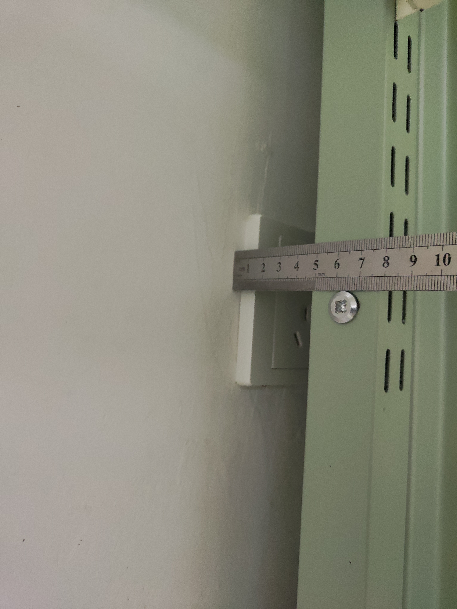

## 总览

以下 13 张照片提供了相当全面的信息，配合注解内容可以涵盖新生对六人间配置的大多数问题。

*提醒读者：受限于测量工具、测量方法和测量环境，以下数据均可能存在误差。*

*另请注意：除床上用品外，大部分物品，如床上桌、插排、床帘等，一概可以到学校后再购买。本文仅用于帮助新生熟悉宿舍布局，不提供任何购买建议。*

<figcaption>图1 1 号床</figcaption>

1、4 号床是下铺。过往上床下桌时期部分人的某些生活习惯可能导致墙皮发生脱落，因此可能需要自行贴墙纸进行遮盖。

1 号床下方的空间高度为 390mm，请留意自己的行李箱是否可以填入其中。

<figcaption>图2 2 号床</figcaption>

2、5 号床是上铺，梯子位于该铺位的下方。

印着北邮校徽的盒子是一个收纳槽，长 800mm，宽 270mm，高 280mm。

<figcaption>图3 3 号床</figcaption>

3、6 号床是上铺，正下方没有梯子，需要通过 2、5 号床下方的梯子到达。

**以上床铺的实测尺寸为 1910mm$\times$910mm。** 但请注意，其它尺寸的床仍然存在，所以购买床垫等床上用品前请务必自行测量一遍，切勿贸然下单。

<figcaption>图4 桌面</figcaption>

每一侧桌子配备有三把椅子，可供三人共用。桌面下方是普通抽屉，没有键盘抽屉。

抽屉宽 560mm，高 80mm，深 380mm，抽屉到地面的高度为 595mm，即桌下可容纳物品的高度。。

桌宽 1930mm，深 600mm。桌面上方有两层置物台，桌面到一层置物台的高度为 350mm。

两层置物台的尺寸基本相同，每个宽 605mm，高 360mm，深 240mm。

就桌面阴影范围来看，台灯可能是必需品。

<figcaption>图5 下铺柜</figcaption>

下铺柜位于 1、4 号床侧，宽 390mm，深 930mm。分两层，上层高 1390mm，下层高 390mm。隔板可拆卸，但没有其它固定点。

<figcaption>图6 上铺柜</figcaption>

上铺柜位于 2、3、5、6 号床侧，深 330mm，分为五格：

- 左区宽 405mm。上格高 750mm，下格高 215mm。
- 右区宽 475mm。上格高 375mm，中格高 300mm，下格高 290mm。

<figcaption>图7 小柜</figcaption>

三个小柜位于桌侧，每个宽 395mm，高 575mm，深 930mm。

柜上已标注对应的床位号。即便有标号，也可与室友协商另行调换。

<figcaption>图8 上铺吊环轨道</figcaption>

上下铺均设置了滑轨和吊环，上下铺有些不同，详见下文[关于床帘](#关于床帘)。

<figcaption>图9 床间隔板</figcaption>

隔板约占半个床宽，有把手，可供上铺学生上下床。隔板为固定板，不可推拉或拆卸。

实测在有把手辅助的情况下，无需踩 2 号床也可上 3 号床。

<figcaption>图10 洞洞板</figcaption>

每个床位均配有洞洞板，洞洞板为金属材质，自带 6 个活挂钩。孔洞水平间距约 25mm。

<figcaption>图11 床垫</figcaption>

不同寝室床垫样式/舒适度有差异，但厚度基本在 70mm 左右，尺寸与床的内径相符。床垫硬度很高。

<figcaption>图12 受遮挡插座</figcaption>

有些寝室的插座会受到床架遮挡，这一点因床位而异。

原本房间内的插座分布是每侧四个，位于下桌。四改六之后，插座分布不变，就成了下铺两插座，下桌两插座，上铺一概没有插座。再加之床架、柜子遮挡，很可能使部分插座无法使用。建议在入学后先实地勘查寝室内可用插座，再商议插排布线和分配问题。

<figcaption>图13 地面</figcaption>

瓷砖大小为 600mm$\times$600mm，缝宽 3mm。

## 关于床帘

沙河六人间在床架上设计了滑轨和吊环，可供设置帘幕。

下铺只有一排滑轨位于外侧（图1），隐私性和遮光性较好。床帘吊环到下方床架的高度为 1290mm。床帘轨道的长度为 1870mm，共有 9+2 环。

上铺有两排独立的滑轨（图8），一排面向过道，一排位于两床间的隔断，隐私性有保证，但遮光性存疑。两排吊环到下方床架的高度均为 1130mm。面向过道的滑轨长 1870 mm，共有 9+2 环；位于隔断处的滑轨长 680mm，共有 5+2 环。

对上铺来说，即便设置了床帘，也会因为床架和天花板间有缝隙而透光（图2、图3 和图8）。透光的区域刚好在洞洞板上，而洞洞板又是反光材料（图10）。因此，使用半包裹的帘幕恐难达到较好的遮光效果。

但使用一体化床帘就会在很大程度上干扰 3、6 号学生上下床，因为床帘的支架会妨碍上床学生抓握隔板。
