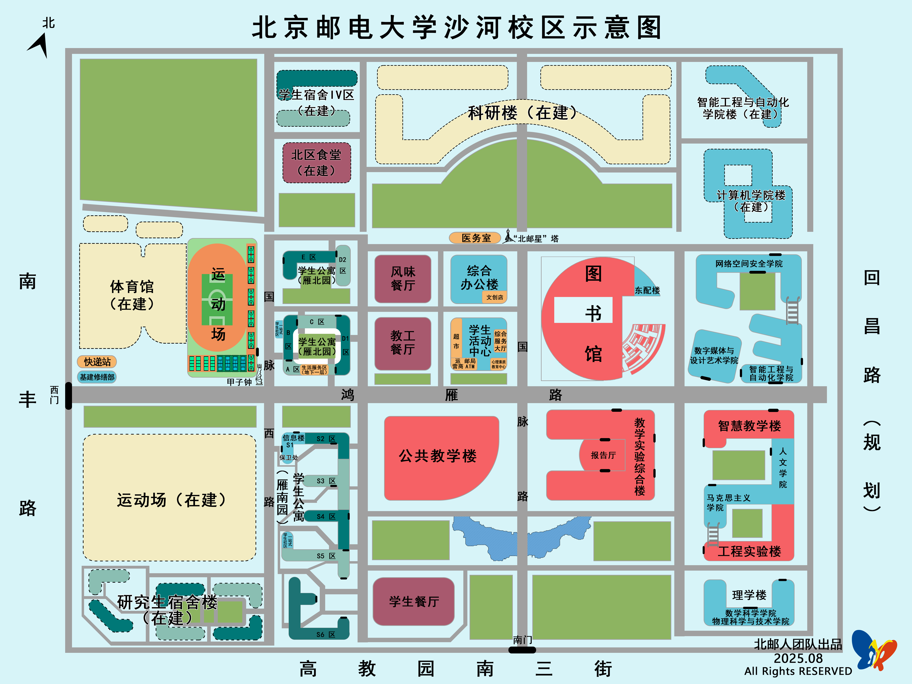

沙河校区位于北京市昌平区沙河高教园区，邮寄地址可填为「**北京市昌平区南丰路 1 号 北京邮电大学沙河校区**」。

地图如下所示。图中校区大小约为 950m × 900m。

本科新生入学后可能会在某年迁至本部。校区搬迁相关攻略请见[校区迁移](/校区迁移/)一章。

---

关于住宿条件的介绍，参见[住宿条件](/沙河校区/住宿条件/)一节。

关于生活服务的介绍，参见[生活服务](/沙河校区/生活服务/)一节。

关于校内及周边餐饮的介绍，参见[餐饮美食](/沙河校区/餐饮美食/)一节。

关于日常活动的介绍，参见[日常活动](/沙河校区/日常活动/)一节。

关于校内外交通工具的介绍，参见[交通往来](/沙河校区/交通往来/)一节。

关于新生军训的介绍，参见[新生军训](/沙河校区/新生军训/)一节。

其它两校区共通的主题，参见[学习生活](/学习生活/学习生活)一章，包括：

- 课程安排、课表、奖学金、毕业要求 
- 转专业
- 校园网及常用网站
- 学生组织
- 体育运动
