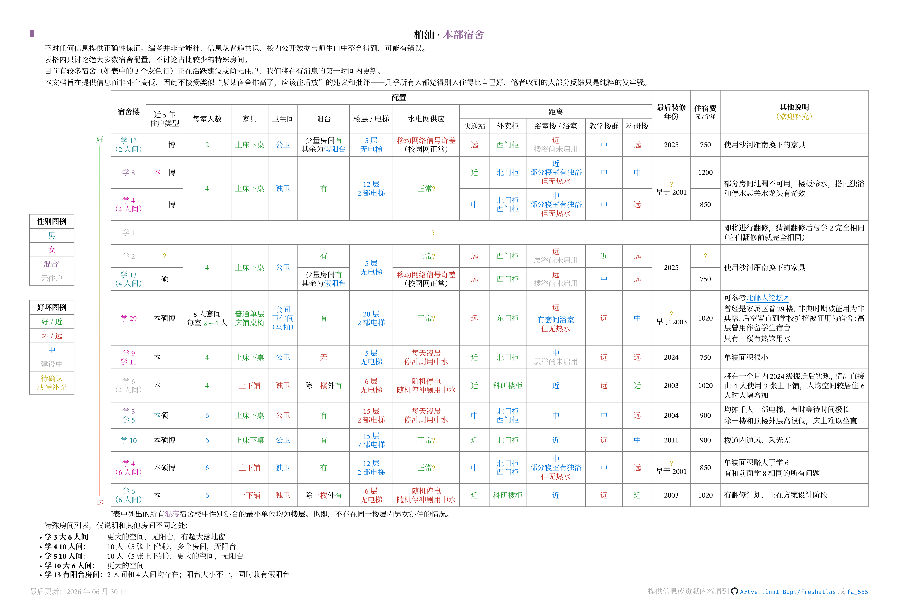

本节介绍海淀校区宿舍分布、住宿环境和宿舍生活相关注意事项。

## 简介

海淀校区宿舍配置比较多样，方差很大，新翻修的学九、学十一条件较好，年久失修的学二、学四、学六条件较差。

学一、学五、学六、学十、学十三为男寝；学四、学九、学十一、学二十九为女寝；学三、学八为混寝。

## 宿舍内环境

各不相同，无法一概而论。

各楼栋在性别、配置、距离、装修年份、住宿费等方面的逐楼横向对比，可参考下图：

> 图片来源：[BUPT-freshatlas](https://github.com/ArtveFlinaInBupt/freshatlas)，原图含沙河、本部两校区，此处已拆分为仅本部部分。以 CC BY-NC-SA 4.0 提供。

<!-- @byrdocs-bot 上图（海淀/本部宿舍逐楼对比）文字版，供无法读图的助手参考；信息以图片为准。表格纵向按“好→差”排序。颜色含义已转为文字：好/近=优，坏/远=差，中=中等；性别用“男/女/混”标注。脚注用 * 标记。距离列顺序为：快递站 / 外卖柜 / 浴室 / 教学楼群 / 科研楼。

逐楼（从好到差）：
1. 学 13（2 人间）（男）：博；2 人间(好)；上床下桌(好)；公卫(中)；阳台少量房间有、其余假阳台；5 层无电梯(中)；移动网络信号奇差、校园网正常(差)；距离：快递远(差) / 外卖西门柜(好) / 浴室远 楼浴尚未启用(差) / 教学中 / 科研远(差)；最后装修 2025；住宿费 750；说明：使用沙河雁南换下的家具。
2. 学 8（混，女本+博）：4 人(好)；上床下桌(好)；独卫(中)；有阳台(好)；12 层 2 部电梯(中)；水电正常(好)；距离：快递近(好) / 外卖北门柜(中) / 浴室近、部分寝室有独浴但无热水 / 教学中 / 科研中；最后装修早于 2001；住宿费 1200；说明：部分房间地漏不可用、楼板渗水，搭配独浴和停水忘关水龙头有奇效。
3. 学 4（4 人间）（女）：博；4 人(好)；上床下桌(好)；独卫(中)；有阳台(好)；12 层 2 部电梯(中)；水电正常(好)；距离：快递中 / 外卖北门柜、西门柜 / 浴室中、部分独浴但无热水 / 教学中 / 科研远(差)；最后装修早于 2001（与学 8 合并单元格）；住宿费 850。
4. 学 1（建设中 / 无住户）：配置待确认；说明：即将进行翻修，猜测翻修后与学 2 完全相同（它们翻修前就完全相同）。
5. 学 2（建设中 / 无住户）：住户待确认；4 人(好)；上床下桌(好)；公卫(中)；有阳台(好)；5 层无电梯(中)；水电正常(好)；距离：快递远(差) / 外卖西门柜(好) / 浴室远 层浴尚未启用(差) / 教学近(好) / 科研远(差)；最后装修 2025；住宿费待确认；说明：使用沙河雁南换下的家具。
6. 学 13（4 人间）（男）：硕；4 人(好)；上床下桌(好)；公卫(中)；阳台少量房间有、其余假阳台；5 层无电梯(中)；移动网络信号奇差、校园网正常(差)；距离：快递远(差) / 外卖西门柜(好) / 浴室远 楼浴尚未启用(差) / 教学中 / 科研远(差)；最后装修 2025；住宿费 750；说明：使用沙河雁南换下的家具。
7. 学 29（女）：本硕博；8 人套间、每室 2～4 人(好)；普通单层床铺桌椅(好)；套间卫生间（马桶）(中)；有阳台(好)；20 层 2 部电梯(中)；水电正常(好)；距离：快递远(差) / 外卖东门柜(好) / 浴室远、有套间浴室但无热水(差) / 教学远(差) / 科研中；最后装修早于 2003；住宿费 1020；说明：曾是家属区眷 29 楼，非典时期作非典塔，后空置，因扩招改为宿舍，高层曾作留学生宿舍，只有一楼有热饮用水。
8. 学 9 / 学 11（女）：本科；4 人(好)；上床下桌(好)；公卫(中)；无阳台(差)；5 层无电梯(中)；每天凌晨停冲厕用中水(差)；距离：快递近(好) / 外卖北门柜(好) / 浴室中 层浴尚未启用 / 教学远(差) / 科研远(差)；最后装修 2024；住宿费 750；说明：单寝面积很小。
9. 学 6（4 人间）（建设中 / 无住户）：本科；4 人(好)；上下铺(差)；独卫(差)；除一楼外有阳台；6 层无电梯(差)；随机停电、随机停冲厕用中水(差)；距离：快递近(好) / 外卖科研楼柜(好) / 浴室近(中) / 教学远(差) / 科研近(好)；最后装修 2003；住宿费 1020；说明：将在一个月内 2024 级搬迁后实现，猜测直接由 4 人使用 3 张上下铺，人均空间较居住 6 人时大幅增加。
10. 学 3（混）/ 学 5（男）：本硕；6 人(中)；上床下桌(好)；公卫(差)；有阳台(好)；15 层 2 部电梯(差)；每天凌晨停冲厕用中水(差)；距离：快递中 / 外卖北门柜、西门柜(中) / 浴室中 / 教学中 / 科研远(差)；最后装修 2004；住宿费 900；说明：均摊千人一部电梯、等待时间极长；除一楼和顶楼外层高很低，床上难以坐直。
11. 学 10（男）：本硕博；6 人(中)；上床下桌(好)；公卫(中)；有阳台(好)；15 层 7 部电梯(中)；水电正常(好)；距离：快递近(好) / 外卖北门柜(好) / 浴室近(中) / 教学远(差) / 科研中；最后装修 2011；住宿费 900；说明：楼道内通风、采光差。
12. 学 4（6 人间）（女）：本硕博；6 人(中)；上下铺(差)；独卫(中)；有阳台(好)；12 层 2 部电梯(中)；水电正常(好)；距离：快递中 / 外卖北门柜、西门柜(中) / 浴室中、部分独浴但无热水 / 教学中 / 科研远(差)；最后装修早于 2001；住宿费 850；说明：单寝面积略大于学 6，有与学 8 相同的所有问题。
13. 学 6（6 人间）（男）：本科；6 人(中)；上下铺(差)；独卫(差)；除一楼外有阳台；6 层无电梯(差)；随机停电、随机停冲厕用中水(差)；距离：快递近(好) / 外卖科研楼柜(好) / 浴室近(中) / 教学远(差) / 科研近(好)；最后装修 2003；住宿费 1020；说明：有翻修计划，正在方案设计阶段。

脚注：
* 表中所有混寝楼性别混合的最小单位均为“楼层”，不存在同一楼层男女混住。

特殊房间（仅说明与其他房间不同之处）：
- 学 3 大 6 人间：更大空间，无阳台，有超大落地窗。
- 学 4 10 人间：10 人（5 张上下铺），多个房间，无阳台。
- 学 5 10 人间：10 人（5 张上下铺），更大空间，无阳台。
- 学 10 大 6 人间：更大空间。
- 学 13 有阳台房间：2 人间和 4 人间均存在；阳台大小不一，兼有假阳台。
-->

## 宿舍外环境

大部分寝室楼都没有独立卫生间，只能使用公共卫生间。（但以海淀校区的宿舍质量来说，无独卫反而是加分项）

绝大部分寝室楼没有独浴、层浴和楼浴，需要前往[公共浴室](/海淀校区/生活服务#浴室)洗浴。

## 宿舍生活

### 用电限制

海淀校区限电比沙河校区更严格，且存在纯电阻检测，一旦检测到纯电阻设备就会跳闸[^1]。

如有合理原因，可向宿管申请扩容。

### 床帘

无限制。

### 查寝

原则上不查人数。

### 门禁与宵禁

海淀校区没有宵禁，但除东门以外其它各门只在 6:00-24:00 开放。其它时段出入学校请走东门。

宿舍楼一般来说存在宵禁，原则上 0:00 到 6:00 不开放，实际执行取决于宿管。如需晚归，可以直接拨打值班电话，无需提前报备。

---

[^1]: 话虽如此，要想绕过纯电阻检测依然有计可施。这里不多作介绍，请询问知情同学。
