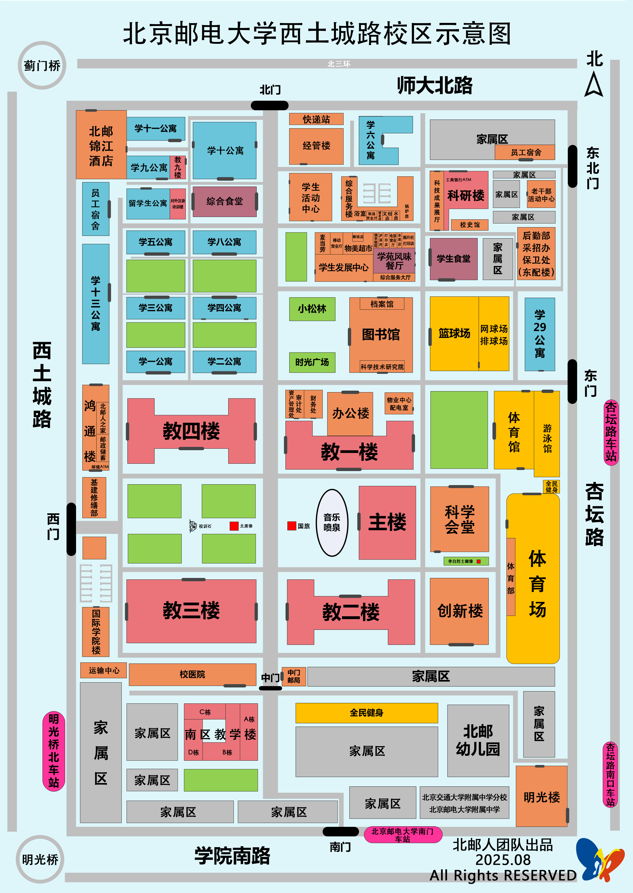

海淀校区（又称西土城路校区、校本部）位于北京市海淀区，邮寄地址可填为「**北京市海淀区西土城路 10 号 北京邮电大学海淀校区**」。

地图如下所示。图中校区大小约为 500m × 750m。

多数本科生将于入学一到两年后由沙河校区搬迁至海淀校区。有关校区搬迁的相关攻略请见[校区迁移](/校区迁移/)一章。

关于住宿条件的介绍，参见[住宿条件](/海淀校区/住宿条件/)一节。

关于生活服务的介绍，参见[生活服务](/海淀校区/生活服务/)一节。

关于校内及周边餐饮的介绍，参见[餐饮美食](/海淀校区/餐饮美食/)一节。

关于日常活动的介绍，参见[日常活动](/海淀校区/日常活动/)一节。

关于校内外交通工具的介绍，参见[交通运输](/海淀校区/交通运输/)一节。

其它两校区共通的主题，参见[学习生活](/学习生活/学习生活)一章，包括：

- 课程安排、课表、奖学金、毕业要求 
- 转专业
- 校园网及常用网站
- 学生组织
